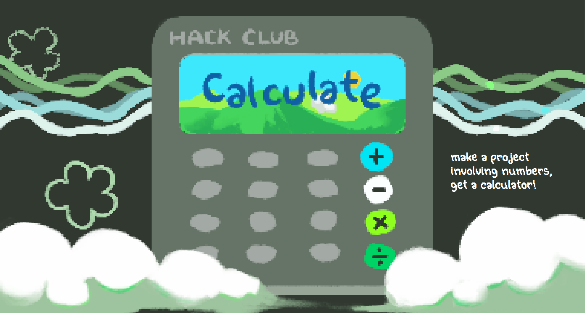

# calculate site!!

hOI!! this is a calculate ysws website! I ran it !!! bascially its just a very normal website with pixel art made by me and information and guides and stuff. it has many pictures that I spent a lot of time putting together and animated pixel art..!! :3

this website had TWO versions:
the original one (was scrapped) and I made new one in June. june!! i starts my internships at June 22nd and it ends July 17th,,, so please count the time before june 21st..!!!. as of writing its july 16. Have a nice day!!!

## how to run this?? (from auto generated nextjs readme)

do `npm i`

and then do this

```bash
npm run dev
# or
yarn dev
# or
pnpm dev
# or
bun dev
```

Open [http://localhost:3000](http://localhost:3000) with your browser to see the result.

## more information

i used nextjs to make this website<br>
i made this in vscode and procreate for the art<br>
link's here: https://calculate.hackclub.com<br>

## picture



## ai use

used ai to make website!! copilot for old website was used for lots of stuff i didn't know how to do- what i can remember was implementing code from online, positioning pixel art so that it looks like how i want it to,.. and from that the new version i didn't use copilot because my school banned it. yay! however, google's search ai may be used when i search for the tailwind equivalent of some class names. i learned how to calculate/position pixel art based on math and stuff from last time ig.

### okie byee
